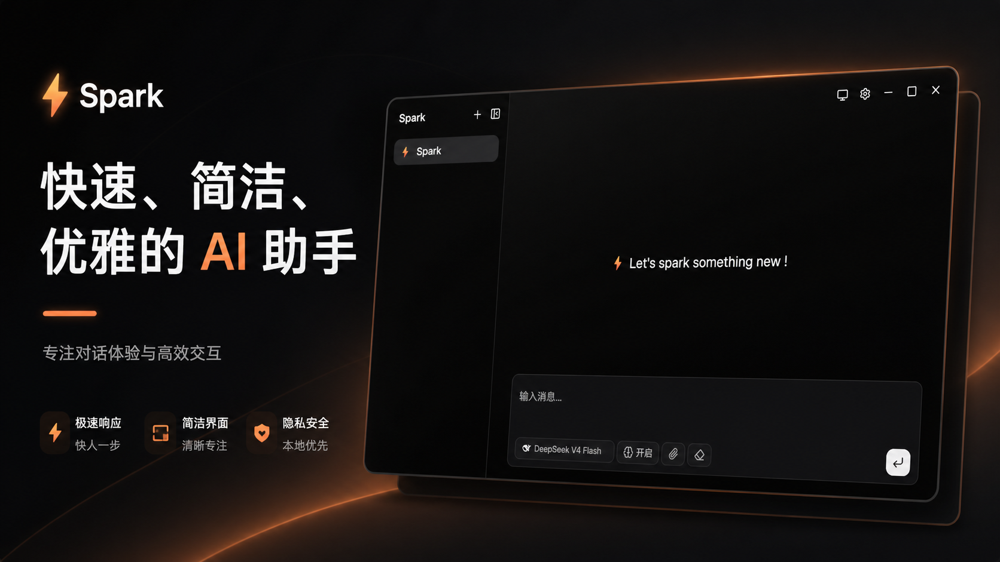

# ⚡ Spark

快速、简洁、优雅的本地AI助手。



基于 Tauri 2 构建，轻量桌面应用，支持多种 AI 模型供应商。

## 功能

- **多模型支持** — OpenAI、Anthropic、Google、DeepSeek、Moonshot、Qwen，以及任意 OpenAI 兼容 API
- **多助手管理** — 创建多个助手，各自独立的系统提示词和对话记录
- **推理模式** — 支持自动/开启/关闭思考模式，适配不同推理模型

## 技术栈

| 层 | 技术 |
|---|------|
| 桌面框架 | Tauri 2 |
| 前端 | React 19 + TypeScript |
| UI 组件 | shadcn/ui + AI Elements |
| 样式 | Tailwind CSS 4 |
| 动画 | Motion |
| 路由 | React Router |
| AI 接口 | AI SDK |
| 构建工具 | Bun + Vite 8 |

## 开发

```bash
# 安装依赖
bun install

# 启动开发模式
bun run tauri dev

# 构建发布
bun run tauri build
```
## 许可

MIT
